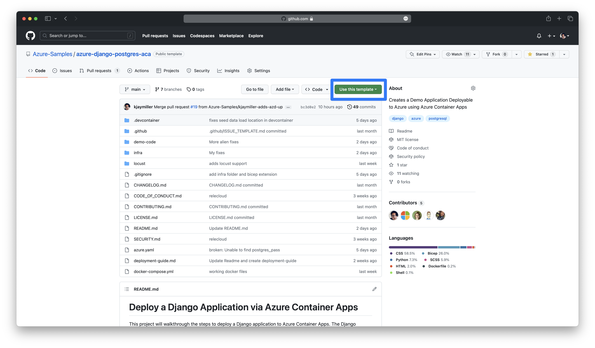

# 🚀 Get Ready for Takeoff

In this lab, you will deploy a Space Tourism site powered by Django and PostgreSQL using Azure Container Apps.

01 Getting Started | [02 Examining the Project](./02-examining-project.md) | [03 Testing](./03-testing.md) | [04 Deploying Locally](./04-deploying-locally.md) | [05 Deploying to Azure](./05-deploying-to-azure.md)  

The steps below will get you up and running to deploy the Relecloud Django application to Azure Container Apps.

## Create your own repo from this template

Open the [Azure-Samples/azure-django-postgres-aca](https://github.com/Azure-Samples/azure-django-postgres-aca) repository and click the "Use this Template" button at the top right hand corner.

Once you have created the repo, launch the repo in GitHub Codespaces or clone it to your local machine.

## Launch in GitHub Codespaces

You can use [GitHub Codespaces](http://aka.ms/codespaces) to launch your repo in a browser-based VS Code environment. This is a great way to get started with no local setup required. GitHub users recieve 60 free hours of Codespaces per month.

Select the green "Code" button in the top right section of the repo page on GitHub and select "Open with Codespaces". If you haven't created a Codespace before, you will be prompted to create one. Once created, you will be taken to your Codespace environment.

You can choose to work from inside your browser or open that Codespace using your local Visual Studio Code.

## Clone to your local machine

Open **your repo** that you have created from Azure-Samples/azure-django-postgres-aca, click Code at the top right, and on the Local tab and copy the clone command for `HTTPS`, `SSH`, or `GitHub CLI` as appropriate.

Run the clone command on your local machine to clone the repo locally.

## Next

Proceed to [02 Examining the Project](./02-examining-project.md)
